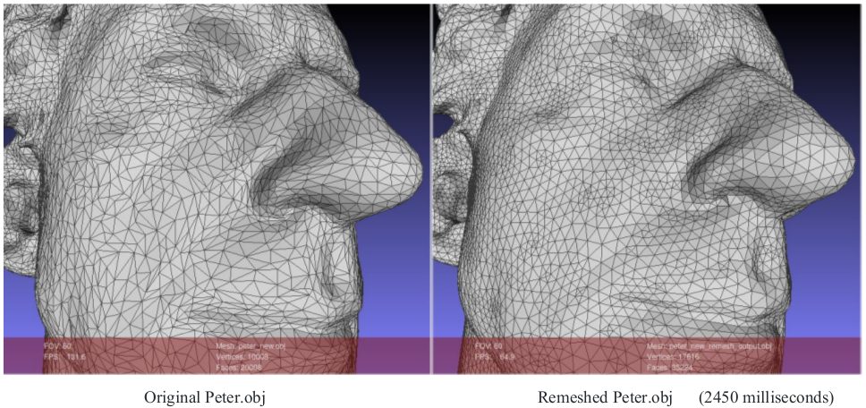
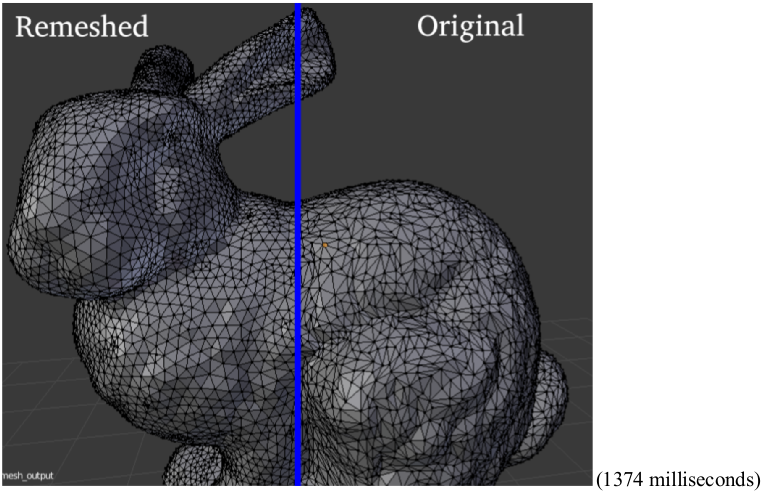
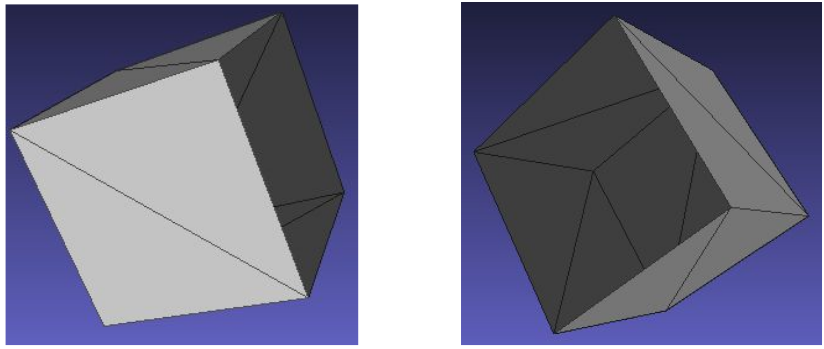
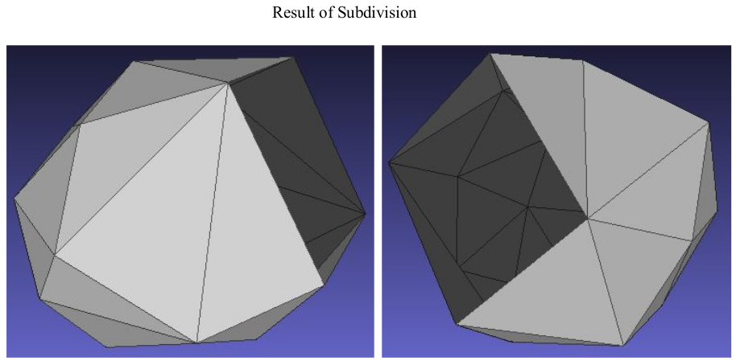

# Mesh Operations: Geometry Processing

Part of [Brown University CSCI2240](https://dritchie.github.io/csci2240/) assignment.


## Description

This project contains code to perform Mesh operations written in C++ and was built on top of the Stencil code provided to
us by the instructors of CSCI2240. Implemented Loop Subdivision, Garland and Heckbert simplification and Iso Remeshing supported by half edge datastructure.

## Requirements

```
Qt ( > 5.9.0)
Qt Creator ( > 4.5.0)
OpenMP
```

## Implementation

### Edge Split ​✔


### Edge Flip ​✔


### Edge Collapse ​✔


### Loop Subdivision ​✔


### Garland and Heckbert Simplification (using quadric error metrics) ​✔


 
From Fig 7 it can be seen that repeated subdivisions and simplifications cause the triangles of the mesh to become irregular. The leftmost image is a regular icosahedron with equilateral triangles but the middle and the rightmost image are icosahedrons with non-equilateral triangles. However, subdivision and simplification combined together preserve the number of vertices and faces.

### Isotropic remeshing ​✔





*Do operations in my code make a manifold mesh into a non-manifold one?*

Remeshing the Stanford bunny model caused the flipMethod to create a non-manifold mesh. However, this is handled in the code by checking if the degree of the `face == 3` and if the neighbouring vertices positions create a “fan-like” structure.

### Mesh with boundaries ​✔

I have implemented boundary handling as part of my halfedge data structure. The idea was inspired by Prof. Keenan
Crane’s implementation and notes of the half edge data structure. The boundary boolean is defined for a face (in the face
class) and the boolean method for both edge and vertex are derived from this i.e for an edge we check if it’s/twin’s face is a boundary and for a vertex we check if one of the edge it is connected to is a boundary (through the aforementioned way).

Subsequently, in each of my flip, split, collapse, subdivision, simplification and remeshing functions, I check if a vertex or edge that is being iterated over is a boundary and proceed accordingly.

In the below example, I removed a side (two triangles) from a cube mesh, thus creating a boundary condition and subdivided it.






