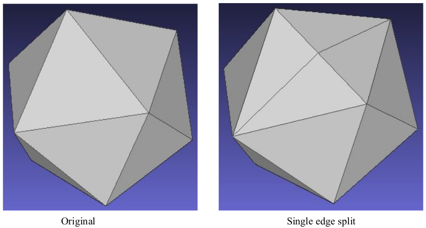
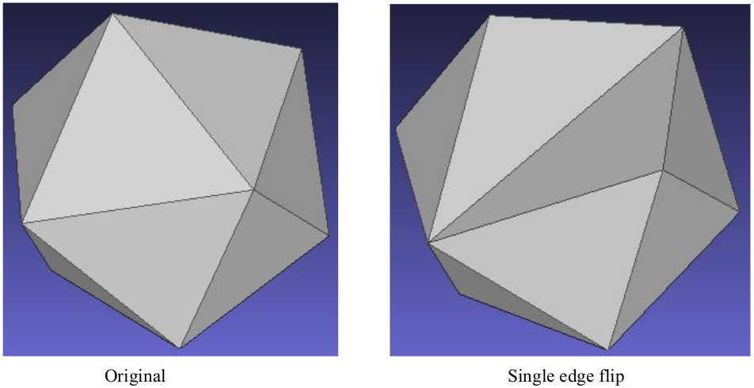
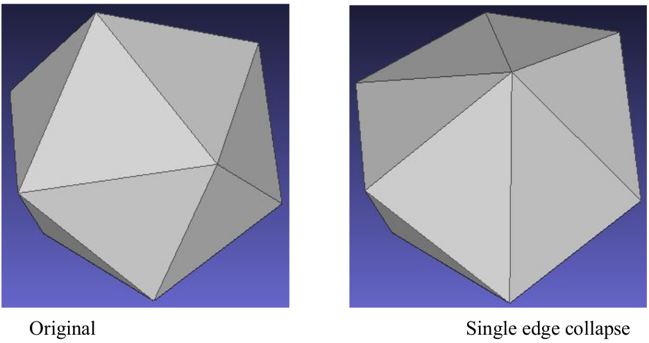
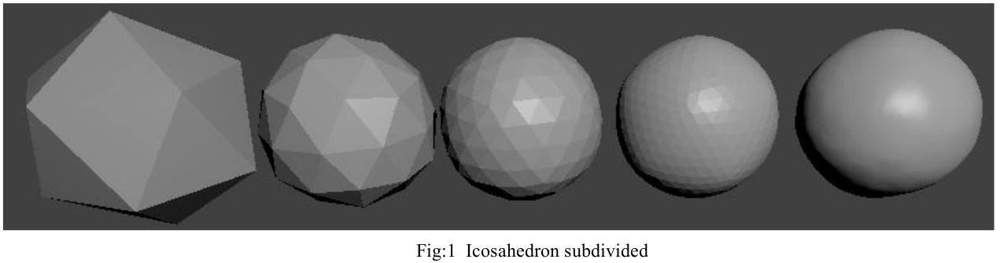
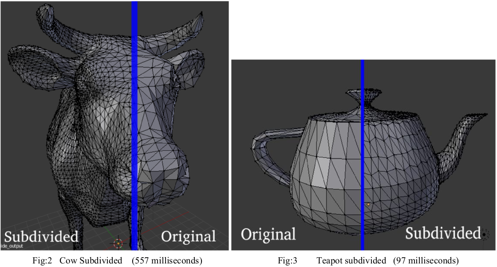
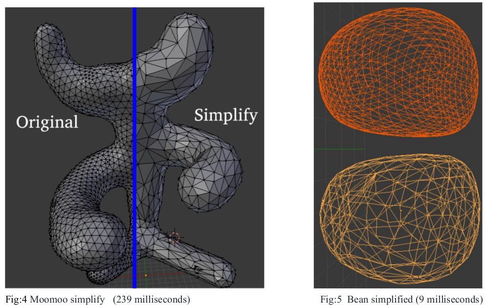
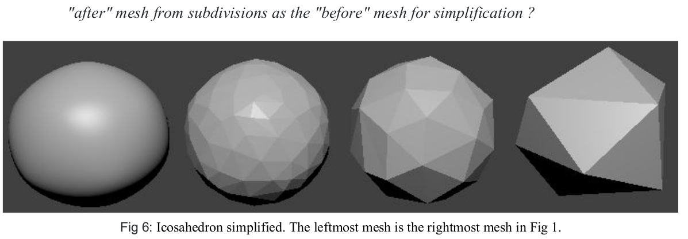
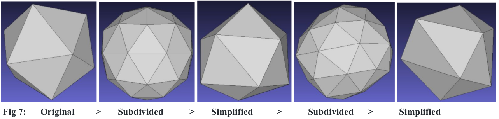

# Mesh Operations: Geometry Processing

Part of [Brown University CSCI2240](https://dritchie.github.io/csci2240/) assignment.


## Description

This project contains code to perform Mesh operations written in C++ and was built on top of the Stencil code provided to
us by the instructors of CSCI2240. Implemented Loop Subdivision, Garland and Heckbert simplification and Iso Remeshing supported by half edge datastructure.

## Requirements

```
Qt ( > 5.9.0)
Qt Creator ( > 4.5.0)
OpenMP
```

## Implementation

#### Edge Split ​✔



#### Edge Flip ​✔



#### Edge Collapse ​✔



#### Loop Subdivision ​✔





#### Garland and Heckbert Simplification (using quadric error metrics) ​✔






 
From Fig 7 it can be seen that repeated subdivisions and simplifications cause the triangles of the mesh to become irregular. The leftmost image is a regular icosahedron with equilateral triangles but the middle and the rightmost image are icosahedrons with non-equilateral triangles. However, subdivision and simplification combined together preserve the number of vertices and faces.


